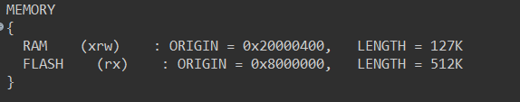

# DỊCH CHUYỂN VECTO TABLE
Vi trong chương trình sẽ dùng đến các hàm ngắt, nhưng để tối ưu tốc độ, ta sẽ viết hàm ngắt và dịch vecto table lên RAM

```C

#include <stdint.h>

void CHI_copy_vecto_table(void)
{
    volatile uint8_t* src = (volatile uint8_t*)0x00000000;  
    volatile uint8_t* dst = (volatile uint8_t*)0x20000000;  
    volatile uint32_t* VTOR = (volatile uint32_t*)0xE000ED08; 

    for (uint32_t i = 0; i < 0x198; i++) {
        dst[i] = src[i];
    }

    *VTOR = 0x20000000;
}
```
Vào file.ld trong project, tìm và sửa theo hình

RAM: 0x20000400, size 127Kb
